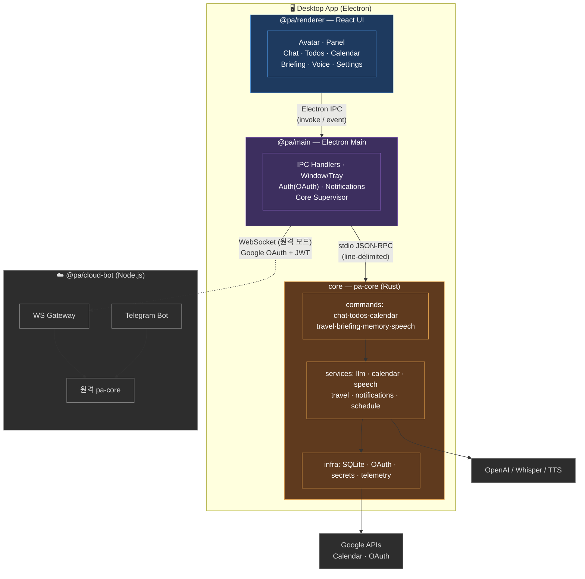
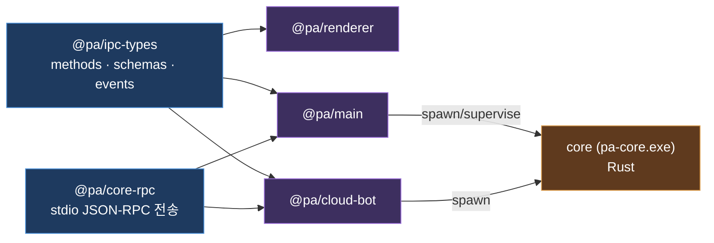
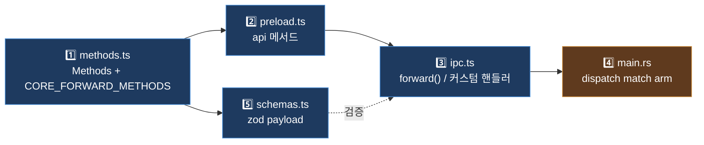
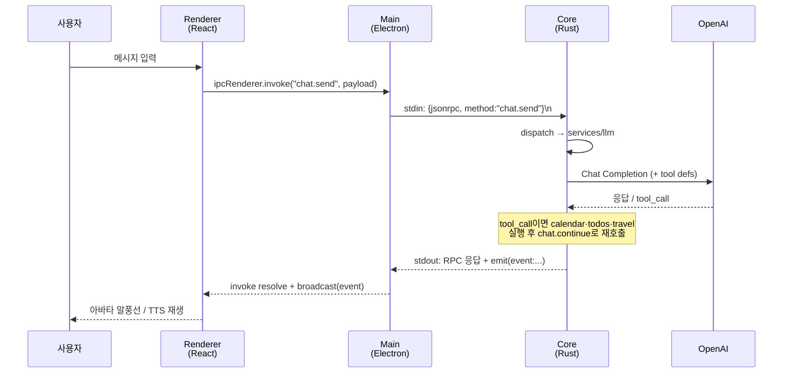
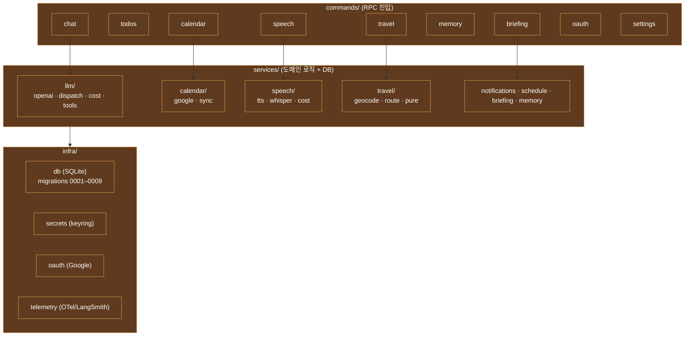

# 아키텍처 한눈에 보기

> Personal Assistant — 데스크톱 위젯형 AI 비서.
> 이 문서는 **구조를 한눈에** 파악하기 위한 그림 모음이다. GitHub·VS Code에서 Mermaid로 렌더된다.
> 상세 동작·불변식은 각 도메인 문서(`docs/<domain>/`)가 정본. 여기는 지도.

---

## 1. 전체 구조 (3-tier + 클라우드)

**핵심 원칙**
- **데이터/상태는 전부 Core**(Rust + SQLite). Renderer는 그리기만, Main은 창·OS 연동·forward만.
- Renderer는 파일/DB 직접 접근 금지 — 반드시 IPC → Core.
- 계층 간 통신은 딱 둘: **Renderer↔Main = Electron IPC**, **Main↔Core = stdio JSON-RPC**.

---

## 2. 워크스페이스 의존 관계 (npm monorepo)

`workspaces: ["apps/*", "packages/*"]`. `core`(Rust)는 npm 워크스페이스가 아니라 별도 프로세스로, Main/cloud-bot이 supervisor로 띄운다.

---

## 3. IPC 5-지점 계약 (메서드 하나 = 5곳 동기화)

> 새 IPC 메서드 추가/이름 변경 시 아래 5곳을 **전부** 맞춰야 함. 하나라도 빠지면 런타임에 깨짐.

**메서드 도메인 분류**

| 처리 위치 | 도메인 |
|---|---|
| **Core forward** (JSON-RPC로 Core에 전달) | `app` · `secret` · `settings` · `chat` · `todos` · `oauth` · `calendar` · `schedule` · `travel` · `memory` · `briefing` · `speech` |
| **Main 자체 처리** (Core forward 없음) | `window` · `auth` · `autoLaunch` · `debug` |

메서드명은 `<domain>.<verb>` dot.case.

---

## 4. 데이터 흐름 예시 — `chat.send`

이벤트(알림·비용 갱신 등)는 Core가 `emit("event:...")` → Main이 여러 윈도우로 `broadcast` → Renderer가 `ipcRenderer.on`으로 수신.

---

## 5. Core(Rust) 도메인 지도

---

## 참고
- 명령어·검증·커밋 규칙: 루트 `CLAUDE.md`
- 도메인 지식 맵: `docs/README.md` → 각 `docs/<domain>/` (UI는 `docs/UI/windowing.md`가 정본)
- 교차-관심 설계 결정: `docs/DECISIONS.md` (D-번호)
